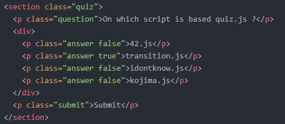
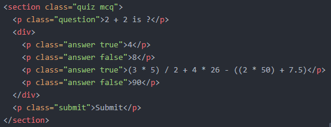

# Documentation

## Introduction&nbsp;:

Quiz.js is a script based on an other script called Transition.js. Transition.js is used for creating presentation using HTML and the script is available at this address&nbsp;: <https://math.unice.fr/~pantz/Geek/transition.html>.

## How to use&nbsp;:

To use this script, you'll need first to install the transition.js script. When this is done, you'll have to download quiz.js available there `./scripts/quiz.js`. The script is fully configurable as you can see from line 1 to 35, you'll can select all the class names used and all the messages that are appended from the script. On this documentation, only default values will be used. Now that everything is installed, you can choose between 2 versions&nbsp;:

Don't forget to include the line `<script type='text/javascript' src='./scripts/quiz.js'></script>` on your index page.

### The local version&nbsp;:

For the local version, you only need HTML and quiz.js script. To create a quiz, you have to add "quiz" class name on each `<section>` tag. Warning, if it's a MCQ, you also need to add "mcq" as class name. Now your section should look like this&nbsp;: `<section class="quiz">` or like this for a MCQ&nbsp;: `<section class="quiz mcq">`. Once this is done, you can add a `<p>` tag with the class "question" that will contain the title of the question. Then, for each answer you just have to add a `<p>` tag with "answer true" or "answer false" (depending if the answer is true or not) as class name. Finally, put an other `<p>` tag with class name "submit" and your quiz is ready. Your code should look like&nbsp;:
<br>
 <br> or like this for a MCQ&nbsp;: <br>


### The online version&nbsp;:

Now, for the online version, you need to import all the files on `./stats/` and don't forget to set your index page from .html to .php. You also need to insert these lines on your file for seeing the charts and for making all the request from the script and the PHP files.
- Script for the charts&nbsp;: `<script src="https://cdn.jsdelivr.net/npm/chart.js@2.8.0"></script>`,
- Scripts for the request&nbsp;: `<script src="https://cdn.jsdelivr.net/npm/axios/dist/axios.min.js"></script>`, <br>
`<script src="https://ajax.googleapis.com/ajax/libs/jquery/3.4.1/jquery.min.js"></script>`.

 Once this is done, you have to change all the information on the file `./stats/config.php`. When it's done, you have to add the class "rated" to the `<body>` tag. The quiz.js script will automatically add all your quiz on your database. Now, when you press the submit button, the script will append a show results button and when you press it, it'll show you a chart with all the answers given.

 if you wish to reload the database (for example, because you added/deleted an answer), you have to add this line on your code `<p class="delete">Reload database</p>`. Pay attention that when you'll press this, all the data on the database will be erased.

 Finally, if you want your presentation to be available on mobile, you just have to import the files `./scripts/mobile.js` and `./styles/mobile.css` and set in your code before the `</body>` tag the following code&nbsp;:
```html
 <span class="mobile_buttons">
     <div class="btn-left">
       <svg style="width:24px;height:24px" viewBox="0 0 24 24">
         <path d="M20,11V13H8L13.5,18.5L12.08,19.92L4.16,12L12.08,4.08L13.5,5.5L8,11H20Z" />
       </svg>
     </div>
     <div class="btn-right">
       <svg style="width:24px;height:24px" viewBox="0 0 24 24">
         <path d="M4,11V13H16L10.5,18.5L11.92,19.92L19.84,12L11.92,4.08L10.5,5.5L16,11H4Z" />
       </svg>
     </div>
   </span>
```

## Some technical points&nbsp;:

Here, a little explanation on how the script works. <br>
First, when the document is loaded, the script stores in the variable allquiz, all the section that contains "quiz" in class name. Then, it sets for each section the attribute "data-quiz", an integer that represents the index of each quiz and then, it fills the array allAnswers with all the answers at the current index and it deletes the "true" or "false" of each answer.
```js
for(var i = 0; i < allquiz.length; i++) {
var currentQuiz = allquiz.eq(i) ;
    currentQuiz.attr('data-quiz', i) ;

    allAnswers[i] = [] ;
    var answers = allquiz[i].getElementsByClassName(answerClassName) ;
    for(var j = 0; j < answers.length; j++) {
      if(answers[j].className.includes('false')) {
      allAnswers[i][j] = false ;
      answers[j].classList.remove('false') ;
    }
    else {
      allAnswers[i][j] = true ;
      answers[j].classList.remove('true') ;
    }
  }
}
```
Then, we have multiple EventListener. The first one line 93, `$('.'+answerClassName).on('click', function() {` is the listener when we click on an answer. The script first checks if the clicked answer wasn't already selected, if yes then it deletes the 'selected' class of the answer and if no, it adds the class name 'selected' to the clicked answer and if the answer isn't from a mcq section, then it deletes the class 'selected' from all others answers.

The second one line 103, `$('.'+submitClassName).on('click', function() {` is used to manage the selected answers when we click on the submit button. First, the script gets the index of the quiz through the "data-quiz" attribute and then, the variable currentQuiz will store the quiz corresponding to this id. Next, it checks if the currentQuiz is a mcq or not. If it is, then it gets all the selected answers through 'selected' class name and verify the position of each selected answer. Then, it checks with the variable allAnswers if each position of the selected answers corresponds to "true" and if everything is correct, it runs the function `answerIsCorrect()` or else the function `answerIsIncorrect()` (the content of these functions can be changed to fit with your presentation). Else, if it's a normal quiz, it just checks if the position of the selected answer corresponds to "true" in the variable allAnswers. Finally, if the quizzes are rated, it shows the result button.

The third EventListener is for the result button, the function `showResults()` is called when you press the button. This function gets from the PHP file `./stats/get_answers_count.php` all the data we need (each answer and the number of votes for each answer). Then, with the function `drawChart()` it displays the chart with all the values it got from the request.

Finally, the last EventListener serves to deselect the selected answers when we press a key (this function is used because we need to press a key to switch between slides on the presentation).

## Credits&nbsp;:

This script was entirely done by ARMANDO Julien as part of individual projects led by the IUT of Nice during the health crisis that affected the whole world. Here the link to access IUT website&nbsp;: <http://unice.fr/iut/presentation/accueil>

The displayed charts are made by another script called Chart.js and available here&nbsp;: <https://www.chartjs.org/>

## License&nbsp;:

Quiz.js is a free, open source script and can be used by anyone wishing to use it.
